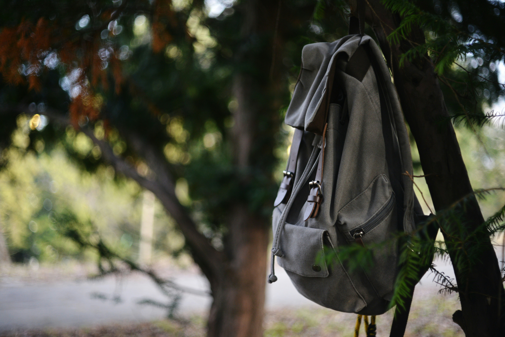
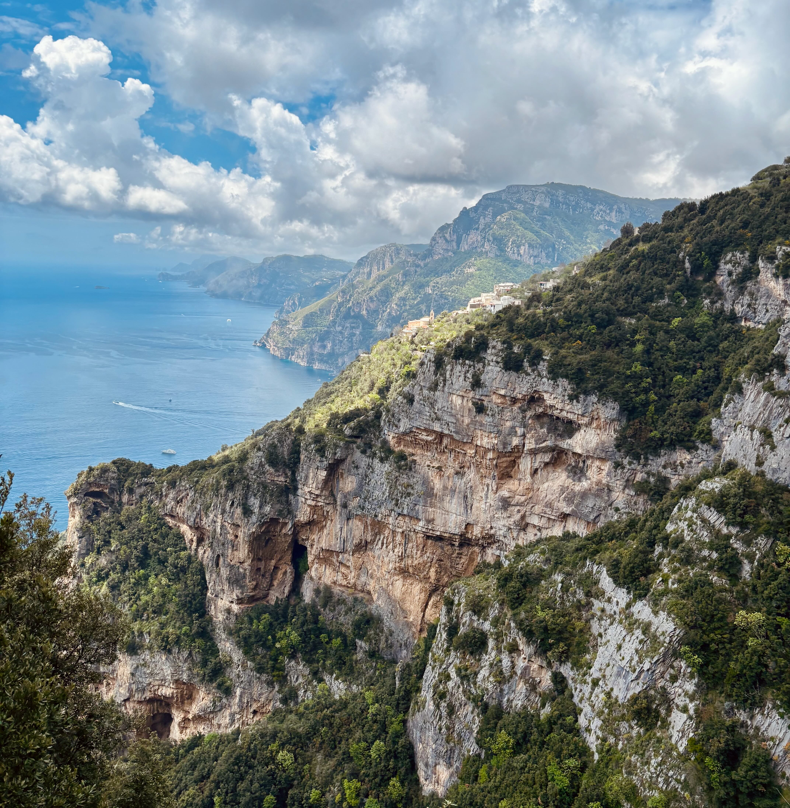

In questo articolo voglio parlare di cosa mettere nello zaino per un'escursione giornaliera.  
Mi riferisco, in particolare, a un'uscita in montagna dai 10 ai 30 km, dove non possiamo contare su servizi fondamentali come bar, ristoranti, ecc.

    <figure class="image is-inline-block" style="width: 55%;">
        
    </figure>

In questi casi consiglio uno zaino da 20 a 25 litri. È inutile portare zaini più grandi e ingombranti, che finiscono solo per appesantirci. Lo zaino, come tutto quello che mettiamo dentro, deve essere leggero. 
Anche se nelle escursioni giornaliere un po' di peso in più non è troppo limitante, cerchiamo di ridurlo. 
Non dobbiamo usare il bilancino (non in questo caso, ma nei trekking di più giorni, io lo uso), ma evitiamo il peso inutile. 
Ad esempio, è inutile portare con noi le confezioni di tutti i medicinali che portiamo, possiamo portare solo la quantità che ci serve. Lo stesso discorso vale con tutto. Mai come in questo caso _Less is more._ 

Viaggiare leggeri e portare con noi solo l'essenziale è la chiave per un'escursione piacevole.

## I fondamentali

Partiamo dai **fondamentali**, e cominciamo dall'acqua. **Dobbiamo sempre portare con noi 1,5/2 litri d'acqua**, in base alla stagione e al tipo di percorso. Ovviamente, nei mesi più caldi e su itinerari più impegnativi, è bene aumentare la quantità. Nel mio caso, evito di portare borracce, che vanno solo ad appesantirmi, e preferisco una sacca idrica o la classica bottiglia di plastica.
Io controllo sempre in anticipo la presenza di fonti lungo il tragitto, aiutandomi con app come _Komoot_ e _Garmin Explore_.

Insieme all'idratazione c'è l'alimentazione. Ricordiamoci di portare con noi un **pranzo al sacco** e qualche **snack** leggero. Per l'alimentazione è sempre consigliato portare cibi facilmente digeribili. Per gli snack, per esempio, prediligere frutta secca, barrette e  cioccolato.

Un altro oggetto fondamentale è la **giacca antipioggia/antivento**, o guscio. È indispensabile in tutte le stagioni: in montagna il meteo può cambiare improvvisamente, e pioggia o vento sono sempre in agguato. Dal momento che in commercio si trovano gusci di alta qualità anche abbastanza leggeri, ricordiamoci di metterlo sempre nel nostro zaino.

Un altro elemento fondamentale è il **kit di primo soccorso**. Il mio l'ho comprato su Amazon, ma può essere tranquillamente assemblato in autonomia. Spesso i kit preconfezionati sono incompleti e vanno integrati con ciò che ci serve. Io, ad esempio, ho aggiunto i cerotti _Compeed_ (indispensabili in caso di vesciche), un po' di sale e di zucchero e dell'insetticida. 

Abbinati al kit di primo soccorso, metto sempre in zaino alcune **medicine**. Io, per esempio, porto con me gli antistaminici e ibuprofene, ma in questo caso dipende dalle esigenze personali.

Portiamo sempre con noi anche i **documenti d'identità**. Inutile sottolineare l'importanza di portarli con noi.

Infine, ma non per importanza, non dimentichiamo il rispetto per la natura e per l'ambiente che stiamo attraversando: portiamo sempre dei **sacchetti per i rifiuti**. Raccogliamo tutto e riportiamolo con noi fino al rientro. [Leave No Trace](https://en.wikipedia.org/wiki/Leave_No_Trace). Sempre.

    <figure class="is-inline-block" style="width: 55%;">
        
    </figure>

## Gli utili

Ho trovato molto utile portare con me un **coltellino multiuso**, come il _Leatherman Signal_. So che è un argomento molto dibattuto: c'è chi preferisce un coltellino semplice per contenere il peso. Io invece preferisco il multiuso, perché ha anche una pinza, utile ad esempio per tagliare rovi che bloccano il sentiero, o per effettuare piccole riparazioni. In ogni caso, consiglio di portare il coltellino multiuso solo se si sa usarlo in sicurezza.

Sempre nello zaino tengo un **accendino antivento**, da usare eventualmente per accendere un fuoco (con estrema attenzione, ovviamente).

In base alla stagione, possiamo valutare di portare con noi un **cappello di lana** e uno **scaldacollo** o _buff_. Il primo è essenziale nei mesi freddi o sulle alte quote, mentre il _buff_ è utile tutto l'anno per proteggerci dal vento o dal sole.

Nello zaino non devono mai mancare anche **salviette e fazzoletti**, utili in mille situazioni.

Sia d'estate che d'inverno, è importante portare con sé la **crema solare**, perché l'esposizione ai raggi UV può essere significativa anche in quota.

Un'altra cosa di cruciale importanza: **un paio di calze di ricambio**. I piedi possono bagnarsi durante il cammino, e tenere le calze bagnate è scomodissimo e può causare vesciche. Ve lo garantisco.

Un oggetto molto consigliato (che però io non porto mai) sono gli **occhiali da sole**, meglio se polarizzati.

## La tecnologia

Porto sempre anche un **power bank**, fondamentale in caso di batteria scarica del telefono.

Un altro oggetto consigliato è la **lampada frontale**. Può servire nel caso faccia buio prima del previsto, oppure se ci troviamo ad attraversare zone scure (ad esempio una grotta).

Io porto sempre anche il mio **navigatore GPS**. Ho scelto il _Garmin eTrex SE_, ma c'è chi si trova bene con gli orologi con GPS integrato. Personalmente sono un po' scettico: tendono a scaricarsi più velocemente e hanno schermi piccoli, meno pratici da consultare. Ma, come si dice, _de gustibus non disputandum est_.

## Gli opzionali

I **bastoncini telescopici** sono molto utili per alleggerire le ginocchia in discesa e migliorare la stabilità. C'è chi li trova scomodi, ma su determinati percorsi si sono rivelati davvero molto utili.

Per citare Douglas Adams in _La guida galattica per gli autostoppisti_, porto sempre con me un **asciugamano**. Ne ho acquistato uno ultraleggero e ad asciugatura rapida, comodissimo in mille occasioni. 

    <figure class="image is-inline-block" style="width: 500px;">
        
    </figure>

Una **sacca impermeabile** o fodera interna può rivelarsi molto utile per proteggere abiti e documenti in caso di pioggia.

## Checklist

Ho creato [questa pagina](https://www.notion.so/Checklist-Zaino-per-escursione-di-1-giorno-1f30663a3b698025afc4d0bc2f7892e6?pvs=4) su Notion contenente una checklist degli oggetti da portare con te durante un'escursione giornaliera. Clonala e spunta gli elementi man mano che li aggiungi nello zaino.

## Conclusioni

Preparare con cura lo zaino per un'escursione di una giornata è un gesto di rispetto verso se stessi, gli altri e la montagna. Portare solo l'essenziale, senza farsi mancare nulla di veramente utile, ci permette di vivere l'esperienza in modo più sereno, sicuro e leggero.

Ricorda: ogni uscita è diversa e va calibrata in base alla stagione, alla lunghezza del percorso e alle proprie esigenze personali. Ma una cosa non cambia mai: la responsabilità che abbiamo quando entriamo in natura. Preparazione e consapevolezza sono le nostre migliori alleate.

Spero che questa breve guida sia stata utile. Hai altri oggetti irrinunciabili nello zaino? Contattami: la montagna è anche condivisione di esperienze.

Buon cammino 🌄